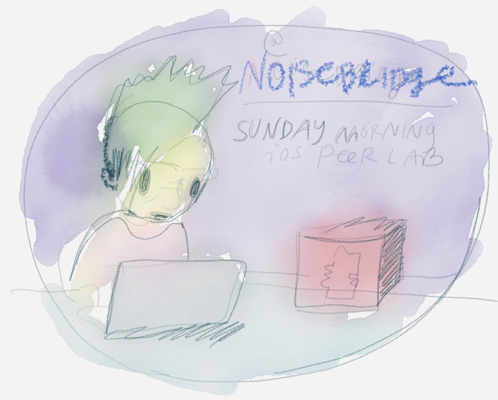

# Javascript Core for Noobs

* [https://www.raywenderlich.com/124075/javascriptcore-tutorial](https://www.raywenderlich.com/124075/javascriptcore-tutorial)

Thanks to K for giving us time to look at stuff at the iOS Peer Lab Sunday Morning at the Noisebridge Hackerspace [meetup](https://localwiki.org/oakland/javascript)

# Happy Engineer advantages
* Able to work with more open-source javascript code
* Get to collaborate better with happy node.js hippies! [https://localwiki.org/oakland/javascript](https://localwiki.org/oakland/javascript)

# Business Advantages

* Less bad UI than hybrid cross-platform html5 apps based on the webview
* Utilize team's javascript code for the drearier tasks like: networking, json parsing, json encoding, anything to do with json.. ;) 
* Don't have to get locked into a proprietary cross-platform tool - you can shop around, pick and choose with your classes
 
